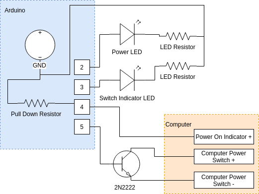

# 💻 Laptop Auto Power-On After Power Loss
**PlatformIO Project for ATtiny13A (Arduino Framework)**

Automatically turn on your **laptop** or other **DC-powered computer** after power loss using an ATtiny13A microcontroller.

This is especially useful for systems that **don’t support the “Power On After Power Loss”** option in BIOS.

---

## 🧠 Overview

The microcontroller monitors the system power via `POWER_STATUS_PIN` and presses the `POWER_SWITCH_PIN` automatically when power is off. Once the system powers on, the controller stops activity until the next full power cycle.

---

## ⚙️ Behavior Logic

1. When power is supplied, the ATtiny13A starts up.
2. It waits **1 second** for voltage stabilization.
3. If the system power (detected via `POWER_STATUS_PIN`) is **off**:
   - Press the **power switch** (`POWER_SWITCH_PIN`) every 1 second.
   - After each press, check the system state again.
4. Once power is detected (`POWER_STATUS_PIN` HIGH):
   - The microcontroller **locks up** (`while(1)`) and stops any further activity until the next full power cycle.

---

## 🧰 Requirements

### 🪛 Tools
- Soldering iron + basic consumables
- USB-to-UART converter with compatible cable for ATtiny13A

### ⚡ Materials
- **ATtiny13A** microcontroller
- **DC/DC step-down voltage regulator**
  - Input: your PSU voltage
  - Output: 5 V for ATtiny13A
- **10–100 µF capacitor** (for power stability)
- **4 connection wires** (ribbon wire recommended):
  1. `DC+`
  2. `DC-`
  3. `POWER_STATUS_PIN`
  4. `POWER_SWITCH_PIN`

---

## 🧑‍🔧 Assembly & Upload

1. **Upload the firmware** using PlatformIO:

    pio run --target upload

2. **Assemble the hardware** following the schematic below:

3. Ensure `POWER_STATUS_PIN` reflects the computer power state by connecting it to **USB 5V+** or an LED indicator line that lights up when the system is ON.

---

## 🧠 Skill Requirements

- Basic soldering and wiring skills
- Familiarity with programming ATtiny13A
- Understanding of electronics and PC power pins

---

## 🤝 Contribute

Improvements and suggestions are welcome!  
Feel free to submit a **pull request** or open an **issue**.
