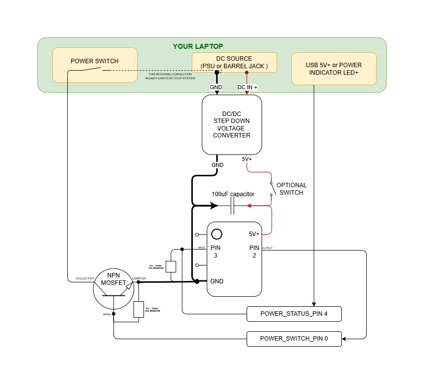

# PlatformIO Project for ATtiny13A Using Arduino Framework  
## Laptop Auto Power ON After Power Loss

---

## Description

Turn on your laptop or other DC-powered computer automatically using a microcontroller.  
Once the power is detected, the **power ON switch** will be immediately pressed.  

This is best for computers **without the "Turn on after power loss" feature** in BIOS.

---

## Behavior Logic

After power is supplied to the system, ATtiny13A starts up.  
It will wait **1 second** for stabilization.

If system power (detected via `POWER_STATUS_PIN`) is **off**:

- It will attempt to press the power switch every **1 second**, checking `POWER_STATUS_PIN` until power comes on.
- Once it’s on → **lock up** (`while(1)`), meaning this service won’t repeat until the next full power cycle.

---

## Skills Requirements

- Soldering
- Programming ATtiny13 with USB/UART converter  

It’s recommended to have basic knowledge of electronics and computer parts to find the appropriate pins to connect to.

---

## Item Requirements

### Tools

- Soldering iron and consumables
- USB/UART converter with USB cable, adapted for ATtiny13A

### Material

- 10–100 µF capacitor
- ATtiny13A microcontroller
- DC/DC step-down voltage regulator:
  - Input voltage: your PSU voltage
  - Output voltage: 5V for ATtiny13A
- 4 wires to connect the respective pins on MCU and your PC  
  *(ribbon wires recommended for tidy assembly)*:
  1. DC+
  2. DC-
  3. `POWER_STATUS_PIN`
  4. `POWER_SWITCH_PIN`

---

## Assembly

1. **Upload the code** with PlatformIO:

    pio run --target upload

2. **Assemble the hardware** following the schematic below:

To ensure `POWER_STATUS_PIN` gets the status of the **computer power state**, connect the pin to **USB 5V+** or an LED indicator of your laptop which glows when the system is ON.

---

## Contribute

Feel free to make a **pull request** to improve the project.
